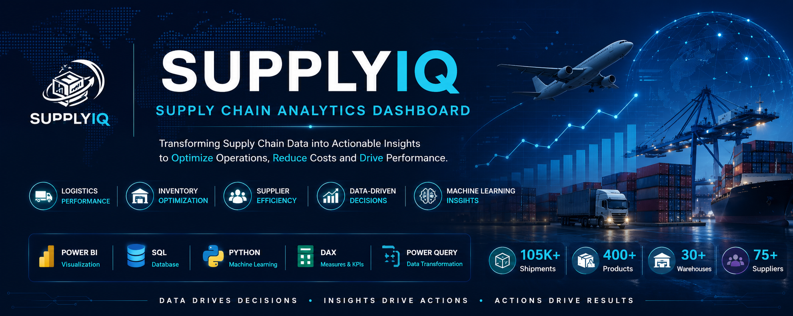
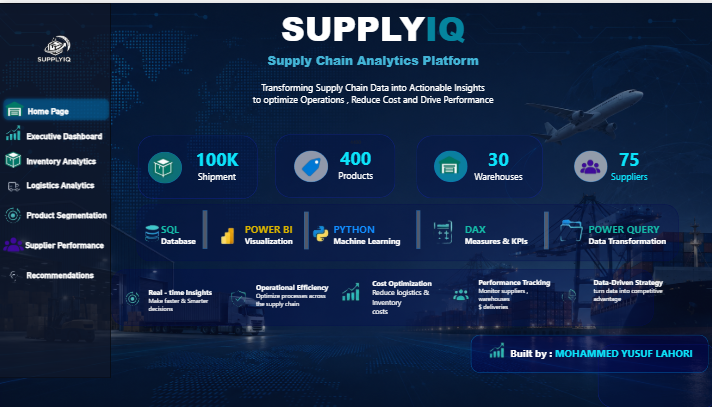
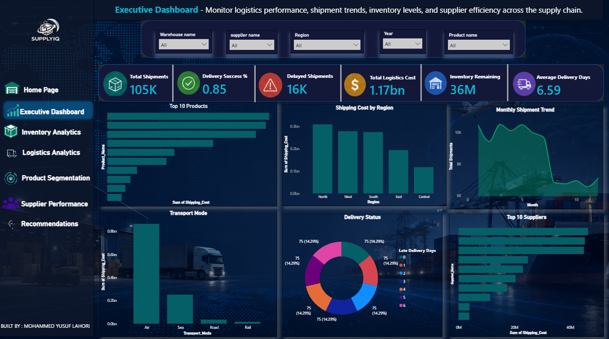
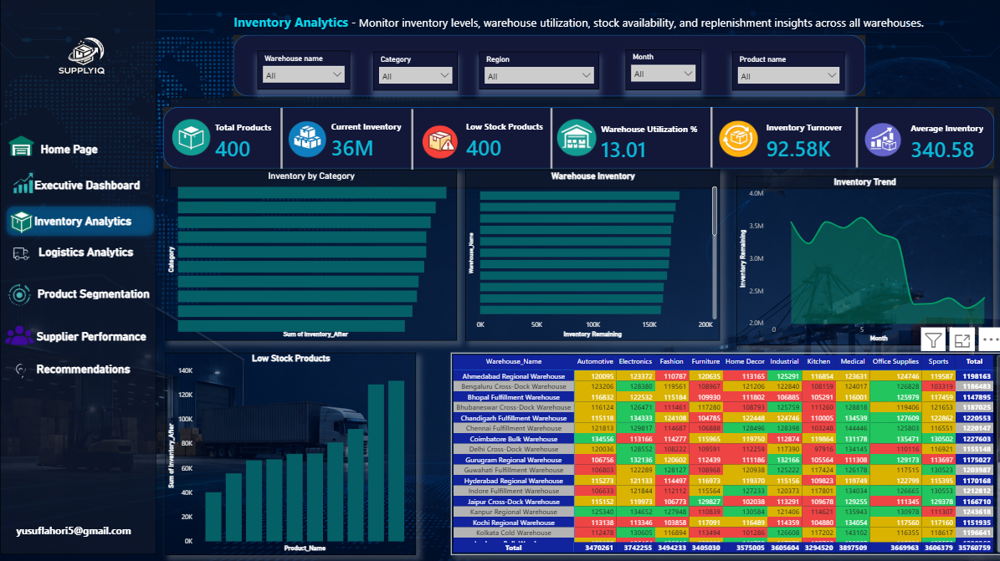
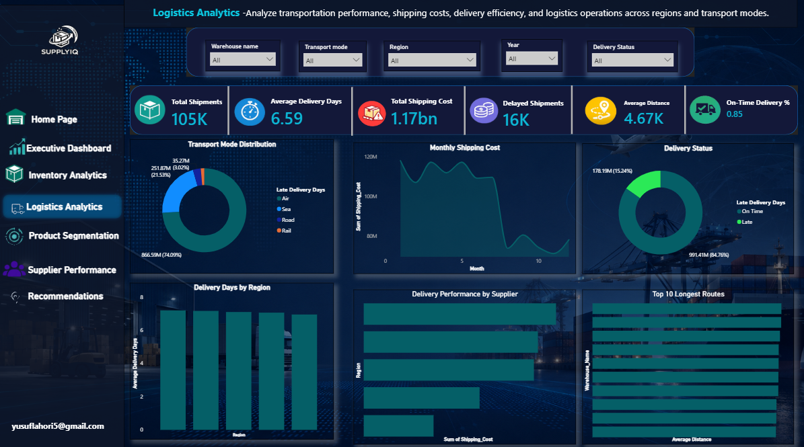
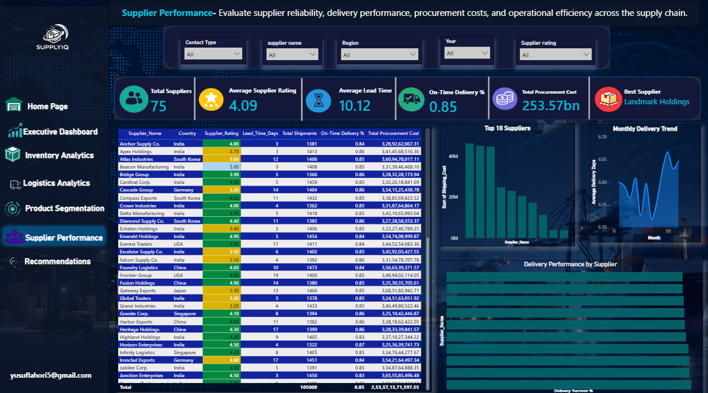
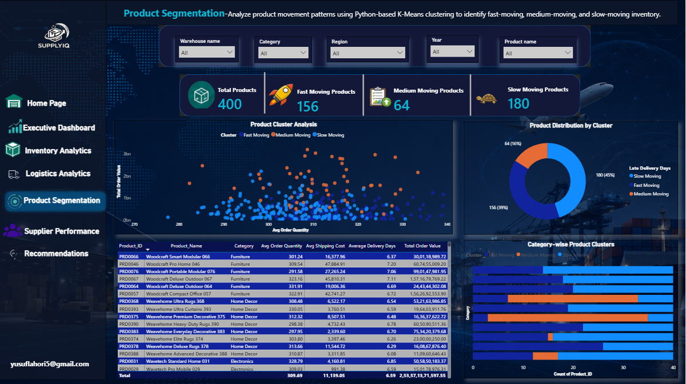
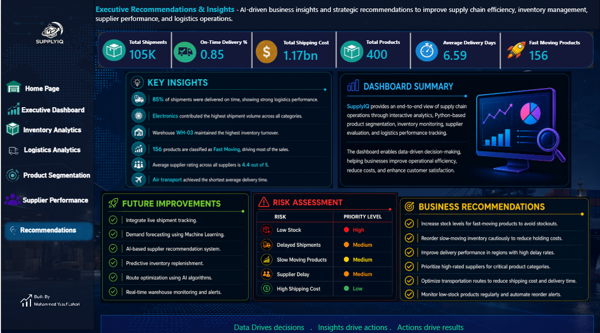
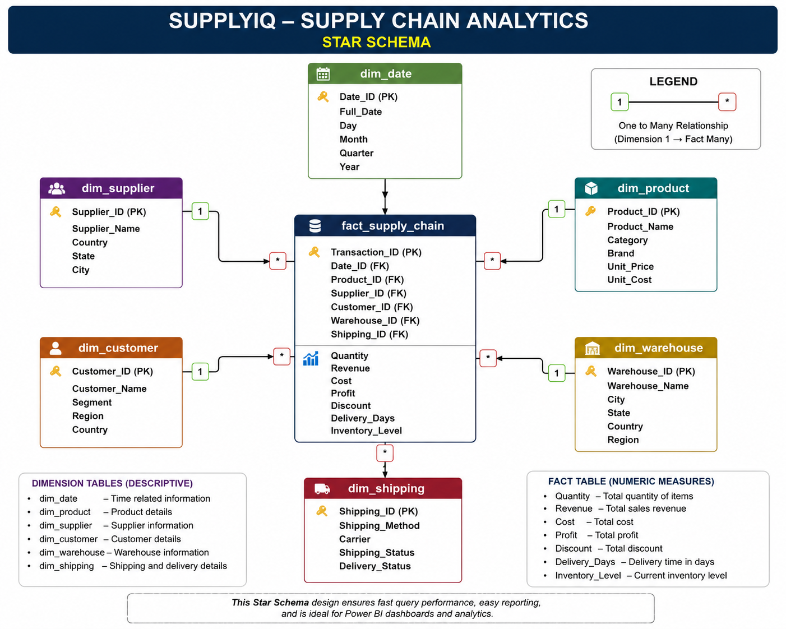

<div align="center">

# SupplyIQ — Supply Chain Analytics

### End-to-End Supply Chain Intelligence with SQL, Python, Power BI, Power Query, and DAX

[](https://github.com/gawandeshil03-ops/data-analytics-bi-portfolio1)
[](https://github.com/gawandeshil03-ops/SupplyIQ)




</div>

## Project Overview

SupplyIQ is an end-to-end supply-chain business intelligence solution for analyzing inventory, logistics, supplier performance, product behavior, delivery efficiency, costs, returns, and profitability.

The solution combines SQL-based data modeling, Python product segmentation, Power Query transformations, DAX measures, and interactive Power BI reporting to convert operational shipment data into decision-ready insights.

## Business Objective

Provide decision-makers with one analytical platform to monitor:

- Revenue and profitability
- Inventory availability and value
- Low-stock, reorder, and overstock conditions
- Logistics costs and delivery performance
- Supplier ratings and lead times
- Return and damage rates
- Warehouse utilization
- Product performance and segmentation

## Project Scale

| Metric | Coverage |
|---|---:|
| Shipment records | 105,000+ |
| Products | 400 |
| Suppliers | 75 |
| Warehouses | 30 |
| Power BI pages | 8 |
| Analytical SQL queries | 63 |

## Technology Stack

| Technology | Purpose |
|---|---|
| Power BI | Interactive dashboards and business reporting |
| Power Query | Data cleaning and transformation |
| DAX | KPIs, calculations, and analytical measures |
| SQL | Database design, loading, and business analysis |
| Python | Product segmentation and analytical processing |
| Pandas and NumPy | Data preparation and feature creation |
| scikit-learn | K-Means clustering |
| Excel | Source-data preparation and validation |

## Analytical Workflow

```text
Supply-chain datasets
   ↓
SQL database and star schema
   ↓
Power Query transformation
   ↓
Python product segmentation
   ↓
DAX measures and KPIs
   ↓
Interactive Power BI dashboards
```

## Dashboard Gallery

### Home Dashboard

Central navigation page providing access to the analytical sections of the report.



### Executive Dashboard

High-level business view of revenue, orders, profit, delivery rate, returns, and damage performance.



### Inventory Analytics

Inventory monitoring across products and warehouses, including stock levels, inventory value, reorder conditions, low stock, and overstock.



### Logistics Analytics

Analysis of shipping cost, fuel cost, transport mode, distance, delivery time, and on-time delivery performance.



### Supplier Performance

Supplier comparison using ratings, lead times, contract types, and delivery performance.



### Product Segmentation

Python-based K-Means clustering using revenue, order quantity, shipping cost, and delivery performance.



### Executive Recommendations

Decision-focused recommendations derived from the supply-chain analysis.



## Star Schema

The analytical model follows a star-schema design to support clear relationships, efficient filtering, reusable measures, and Power BI performance.



## Analytical Areas

<details>
<summary><strong>Inventory Analytics</strong></summary>

- Stock quantity
- Inventory value
- Reorder status
- Low-stock detection
- Overstock detection
- Warehouse utilization

</details>

<details>
<summary><strong>Logistics Analytics</strong></summary>

- Shipping and fuel costs
- Delivery time
- Distance analysis
- Transport-mode comparison
- On-time delivery rate
- Return and damage rates

</details>

<details>
<summary><strong>Supplier Analytics</strong></summary>

- Supplier ratings
- Lead times
- Contract types
- Delivery performance
- Supplier comparison

</details>

<details>
<summary><strong>Product Segmentation</strong></summary>

K-Means clustering based on:

- Revenue
- Order quantity
- Shipping cost
- Delivery performance

</details>

## Business KPIs

- Total Revenue
- Total Orders
- Total Profit
- Inventory Value
- Shipping Cost
- Delivery Rate
- Return Rate
- Damage Rate
- Average Delivery Time
- Warehouse Utilization

## Repository Structure

```text
SupplyIQ/
├── README.md
├── banner.png
├── SupplyIQ.pbix
├── supplyiq_demo.mp4
├── 01_create_tables.sql
├── 02_insert_dimensions.sql
├── 03_load_fact_table.sql
├── 04_sample_analytics_queries.sql
├── 05_data_dictionary.md
├── product_segmentation.py
├── product_segmentation.ipynb
├── dim_product.csv
├── dim_supplier.csv
├── dim_warehouse.csv
├── fact_shipments.csv
├── segmented_products.csv
├── home_dashboard.png
├── executive_dashboard.png
├── inventory_analytics.png
├── logistics_analytics.png
├── supplier_performance.png
├── product_segmentation.png
├── executive_recommendations.png
└── star_schema.png
```

## Getting Started

1. Clone the repository:

   ```bash
   git clone https://github.com/gawandeshil03-ops/SupplyIQ.git
   cd SupplyIQ
   ```

2. Open `SupplyIQ.pbix` using Power BI Desktop.
3. Connect the report to the supplied datasets if Power BI requests updated source paths.
4. Review the SQL scripts for database creation and analytical queries.
5. Open `product_segmentation.ipynb` or run `product_segmentation.py` to review the clustering workflow.

## Suggested Enhancements

- Add demand forecasting and safety-stock calculations
- Compare K-Means with hierarchical clustering
- Introduce supplier-risk scoring
- Add route and warehouse optimization scenarios
- Automate data validation and refresh
- Add Row-Level Security for business users
- Publish the report to Power BI Service

## Attribution and License

- **Repository:** [github.com/gawandeshil03-ops/SupplyIQ](https://github.com/gawandeshil03-ops/SupplyIQ)
- **Original reference:** [MohammedYusufL/SupplyIQ-Power-BI-Supply-Chain-Analytics](https://github.com/MohammedYusufL/SupplyIQ-Power-BI-Supply-Chain-Analytics)
- **License supplied with the reference project:** MIT License

Retain all applicable copyright, attribution, and license notices when reusing or redistributing licensed material.

## Portfolio Contact

**Shil Gawande**  
[LinkedIn](https://www.linkedin.com/in/shilgawande2004) · [GitHub](https://github.com/gawandeshil03-ops) · [+91 9172937014](tel:+919172937014)

---

<div align="center">

[← Return to Main Portfolio](https://github.com/gawandeshil03-ops/data-analytics-bi-portfolio1)

</div>
